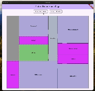
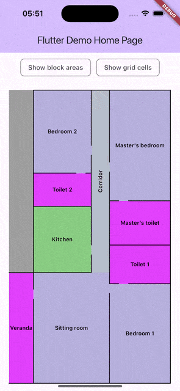

# Schematics 📐

A customisable and responsive Flutter widget for creating and displaying schematic diagrams.

[][pub]
[][repo]
[][repo]

[][issues]
[][license]

## Table of Content

- [Features](#features)
- [Usage](#usage)
- [Installation](#installation)
- [License](#license)
- [Screenshots](#screenshots-)

## Features

- `2D schematic map/diagram`: Allows you to create and display 2D diagrams, maps, and floor plans.
  Entrances and openings: You can add entrances and openings to your diagrams, which can be either
  line openings or arc openings.
- `2D grid map`: Provides a grid where the schematic is drawn, specifying the areas that are the
  blocks on the diagram.
- `Line openings`: Simple straight-line openings that can be added to blocks.
- `Arc openings`: Curved openings that can be semicircles, sectors, or quarter circles.

## Usage

To use the `Schema` widget for creating and displaying schematic diagrams, you need to understand
the following
concepts:

1. **Schema**: The `Schema` widget serves as the base for all blocks used in the schematics. It
   takes a `config` parameter, which is a `SchemaConfiguration` object.

2. **Schema Configuration**: The `SchemaConfiguration` object includes properties such as size, axis
   scale initialization, and other configurations.

3. **Blocks**: The `Schema` widget takes a list of `Block` objects. Each `Block` has properties like
   height, width, border, fence border, label, label style, position, and stroke width.

4. **Block Layout**: The `Schema` widget also takes an `onBlockLayout` callback, which returns a
   list of `BlockArea` objects representing all the block areas in the schema.

5. **Grid Update**: The `Schema` widget also takes `onGridUpdate` callback returns the updated grid,
   highlighting different positions on it.

6. **onBlockAreaTap**: The `Schema` widget `onBlockAreaTap` callback returns the tapped block area
   and local and global positions of the tap.

### Example

```dart
import 'package:flutter/material.dart';
import 'package:schematics/schematics.dart';

void main() {
  runApp(MyApp());
}

class MyApp extends StatelessWidget {
  @override
  Widget build(BuildContext context) {
    return MaterialApp(
      home: Scaffold(
        appBar: AppBar(title: Text('Schematics Example')),
        body: Schema(
          config: SchemaConfiguration(
            size: SchemaSize(cell: kDefaultSchemaSize.cell, opening: 25),
            initiateAxesScale: (constraints) =>
                AxesScale(
                  x: 1,
                  y: 1,
                  opening: 1,
                ),
            // other properties
          ),
          blocks: [
            Block(
              height: 100,
              width: 100,
              border: Border.all(color: Colors.black),
              fenceBorder: FenceBorder.all,
              label: 'Block 1',
              labelStyle: TextStyle(color: Colors.black),
              position: Offset(50, 50),
              strokeWidth: 2.0,
            ),
            // other blocks
          ],
          onBlockLayout: (blocks) {
            // Perform operation with blocks
          },
          onGridUpdate: (grid) {
            // handle grid update
          },
          onBlockAreaTap: (blockArea, globalPosition) {
            // handle block area tap
          },
        ),
      ),
    );
  }
}
```

Refer to example project [here](https://github.com/CoderNamedHendrick/schematics/tree/main/example).

> [!NOTE]
> For more real-world example, check-out the 2024 Lagos Devfest
> application [here](https://github.com/GDG-W/cave/blob/dev/packages/conferenceapp/lib/src/features/more/presentation/screens/venue_map.dart)

## Installation

Add `schematics` as a dependency in your `pubspec.yaml` file:

```yaml
dependencies:
  schematics: ^latest_version
```

Then run `flutter pub get` to fetch the package.

## License

This project is licensed under the MIT License - see the [LICENSE](LICENSE) file for details

## Screenshots 📱




## 🤓 Developer(s)

[](https://github.com/CoderNamedHendrick)

#### **Sebastine Odeh**

[][github]
[][linkedin]
[][twitter]
[][gmail]

[pub]: https://pub.dev/packages/schematics

[repo]: https://github.com/CoderNamedHendrick/schematics

[issues]: https://github.com/CoderNamedHendrick/schematics/issues

[license]: https://github.com/CoderNamedHendrick/schematics/blob/main/LICENSE

[github]: https://www.github.com/codernamedhendrick

[linkedin]: https://www.linkedin.com/in/sebastine-odeh-1081a318b

[twitter]: https://x.com/H3ndrick_

[gmail]: mailto:sebastinesoacatp@gmail.com
