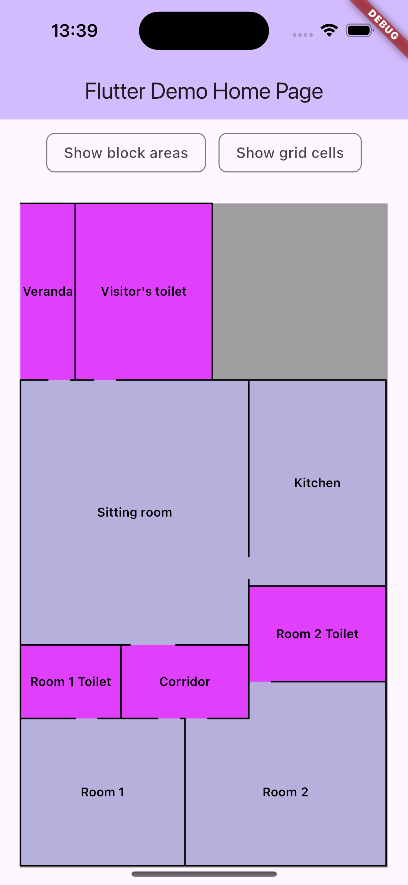
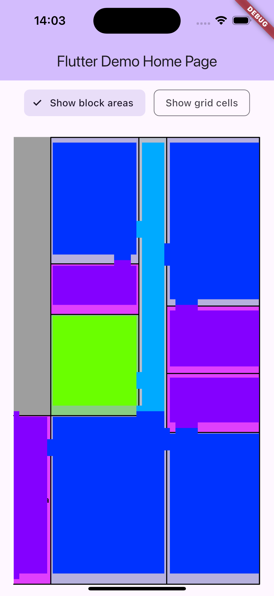
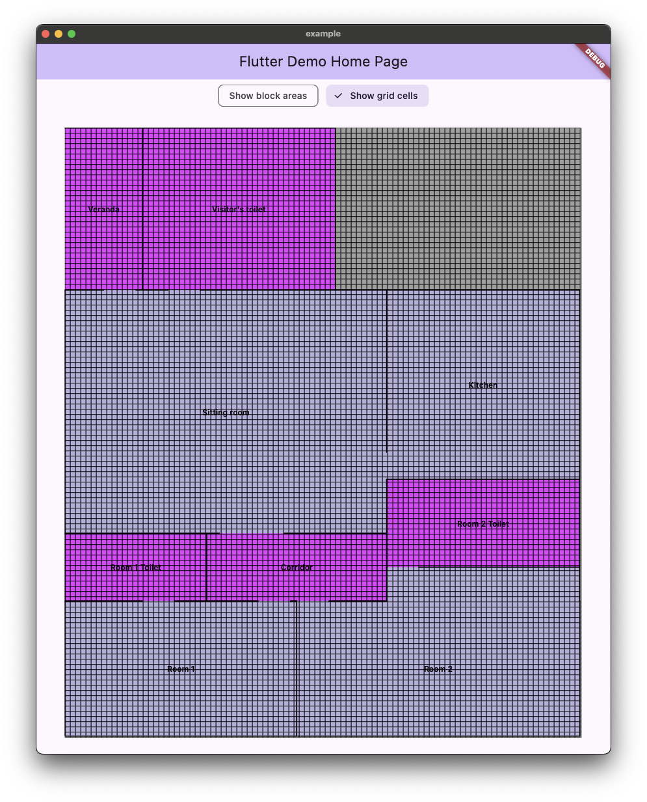
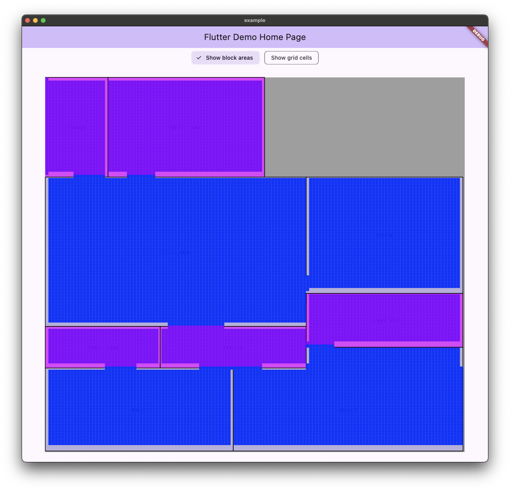

# Schematics 📐

A customisable and responsive Flutter widget for creating and displaying schematic diagrams.


## Table of Content

- [Features](#features)
- [Usage](#usage)
- [Installation](#installation)
- [License](#license)
- [Screenshots](#screenshots-)

## Features

- 2d schematic map/diagram

## Usage

Refer to example project [here](https://github.com/CoderNamedHendrick/schematics/tree/main/example).

## Installation

Add `schematics` as a dependency in your `pubspec.yaml` file:

```yaml
dependencies:
  schematics: ^latest_version
```

Then run `flutter pub get` to fetch the package.

## License

This project is licensed under the MIT License - see the [LICENSE](LICENSE) file for details

## Screenshots 📱







## Connect With Me


